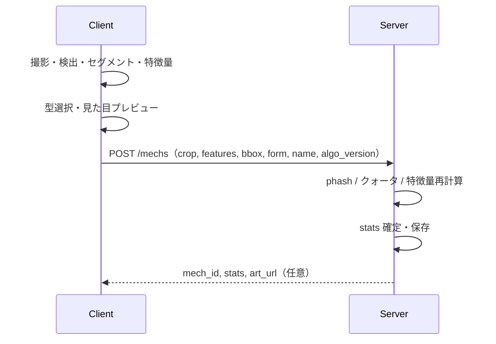
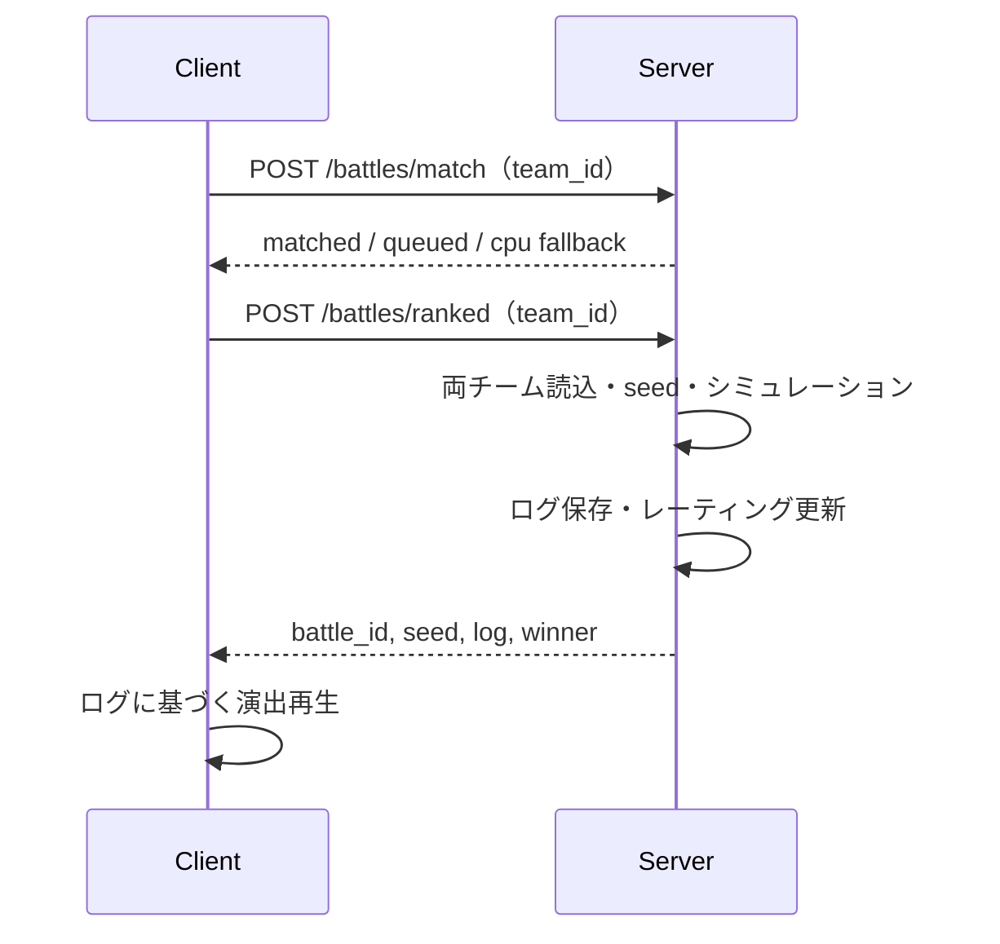

# 09. 軽量サーバー・アーキテクチャ設計

## 目的

本ドキュメントは、**サーバーを薄く保ち、処理の大半をモバイルクライアントに寄せる**前提でのシステム設計を定義する。

`docs/00`〜`08` と矛盾する記述がある場合、**本書の分担・API方針を優先する**。ゲームルール（バトル式、型相性、課金公平性、情報量スコアの意味など）は `docs/03`〜`06` を引き続き正本とする。

## 設計方針（要約）

| 原則 | 内容 |
|---|---|
| サーバーは薄く | 永続化・マッチング・バトル確定・課金検証・不正対策の**最終判定**に集中する |
| クライアントは厚く | 撮影UX、検出/セグメント/特徴量、戦術編集UI、バトル演出を担う |
| バトルはサーバー権威 | 非同期PvPの公平性のため、勝敗・ログ・seed はサーバーで確定する（`docs/05`） |
| 性能はクライアント由来、権威はサーバー | 特徴量・ステータスはクライアントで算出してよいが、サーバーが同じ式で検証してから確定する |
| 見た目と戦闘性能の分離 | 生成画像は見た目のみ。戦闘性能は分析値から決定する（`docs/00` 原則2） |
| 重い推論は段階導入 | i2i 等の高コスト処理は MVP では簡易スタイライズとし、必要時のみ非同期ワーカーを足す |

## 全体構成

```text
┌─────────────────────────────────────────────────────────────┐
│  iOS / Android Client（厚め）                                │
│  ├─ Camera / 撮影品質警告（明るさ・ブレ）                     │
│  ├─ 物体検出・セグメント（オンデバイス推論 or 軽量処理）       │
│  ├─ 特徴量算出・情報量プレビュー                              │
│  ├─ メカ型選択・見た目プレビュー（軽量スタイライズ）           │
│  ├─ 戦術エディタ・チーム編成UI                                │
│  ├─ RevenueCat SDK（購入・復元・CustomerInfo）               │
│  └─ バトルログの演出再生（サーバー返却の seed + log）          │
└───────────────────────────┬─────────────────────────────────┘
                            │ HTTPS（JSON / 画像アップロード）
┌───────────────────────────▼─────────────────────────────────┐
│  Backend API（薄め・Python 等）                               │
│  ├─ Auth / ユーザー・レーティング                             │
│  ├─ メカ・戦術・チームの永続化                                │
│  ├─ 入力検証（perceptual hash、特徴量再計算、クォータ）        │
│  ├─ 非同期PvP マッチング・キュー                              │
│  ├─ バトルシミュレーション（決定的・seed 固定）                 │
│  ├─ ランキング・バトルログ保存                                │
│  └─ RevenueCat Webhook / Entitlement 同期                    │
└───────────────────────────┬─────────────────────────────────┘
                            │ 必要時のみ
┌───────────────────────────▼─────────────────────────────────┐
│  Optional Workers（MVP 外・将来）                             │
│  └─ 高品質 i2i 生成（非同期ジョブ、GPU）                       │
└─────────────────────────────────────────────────────────────┘
```

## 責務分担

### クライアントが担うもの

| 領域 | 内容 | 備考 |
|---|---|---|
| 撮影UX | プレビュー、被写体ガイド、明るさ・ブレ警告 | `docs/02` |
| 物体検出 | 候補 bbox / マスクの提示 | ユーザーが候補選択・タップ補正 |
| セグメント | 背景分離、マスク後処理（穴埋め・ノイズ除去） | 手動矩形・タップ補正はクライアント |
| 特徴量 | `FeatureVector` の算出、情報量スコアのプレビュー | 式は `docs/03` とサーバー実装と一致させる |
| メカ見た目（MVP） | クロップへの簡易スタイライズ（フォーム別シルエット等） | 戦闘性能に影響しない |
| 戦術編集 | スロット編集、プリセット選択、チーム編成UI | |
| バトル | **演出のみ**。ターン進行アニメーション、ログ表示 | 勝敗計算はしない |
| 課金UI | Paywall、購入、復元 | SDK はクライアント必須 |

### サーバーが担うもの（MUST）

| 領域 | 内容 | 理由 |
|---|---|---|
| 認証 | ユーザー登録、トークン発行 | |
| 永続化 | users / mechs / tactics / teams / battles | |
| 非同期PvP | マッチングキュー、対戦相手解決 | 単独端末では不可能 |
| バトル確定 | seed 生成、シミュレーション、勝敗・ログ保存 | サーバー権威（`docs/05`） |
| ランキング | レーティング更新 | |
| 不正対策（最終） | perceptual hash、クォータ、特徴量の再検証 | クライアント単独は信用しない |
| 課金（最終） | Webhook 受信、Entitlement 保持 | クライアントのみで確定しない（`docs/07`） |

### サーバーが担わないもの（本設計）

| 領域 | 方針 |
|---|---|
| リアルタイム物体検出の毎フレーム推論 | クライアント。サーバーは確定後の1回だけ受け取る |
| セグメントのインタラクティブ編集ループ | クライアント。確定マスクのみ送信 |
| バトル演出・エフェクト | クライアント |
| 自然言語戦術LLM（将来） | 原則クライアント（ローカルLLM）。`docs/06` |

## 信頼モデル

クライアント算出値は**入力候補**として扱い、サーバーが**確定値**を返す。

```text
1. クライアントが crop 画像 + feature_vector + bbox + メタデータを送信
2. サーバーが以下を実行
   a. perceptual hash による重複・使い回し検出
   b. 日次クォータ消費
   c. 特徴量の再計算（同一アルゴリズム・同バージョン）
   d. クライアント値との差分が閾値超なら reject またはサーバー値で上書き
   e. info_score → MechStats をサーバー式で確定
3. 確定した stats / art_url（任意）を保存して返却
```

| 検証項目 | サーバー側の扱い |
|---|---|
| `feature_vector` 各次元 | 0.0〜1.0、再計算値との差分 ≤ ε（例: 0.05） |
| `info_score` | サーバー再計算を正とする |
| `MechStats` | 常にサーバー再計算。クライアント送信値は無視 |
| 画像 | crop の phash、最小解像度、極端な単色画像の拒否 |
| バトル入力 | 保存済み mech_id / tactic_id のみ参照。クライアントから stat を送らない |

**バトル中に LLM は使わない**（`docs/00` 原則5）。

## データフロー

### メカ生成（軽量サーバー版）



従来の多段 API（`upload → detect → segment → analyze`）は**開発用・互換用**とし、本番クライアントの主経路は **1 リクエストでのメカ登録** とする。

### 非同期PvPバトル



クライアントはバトル結果を再計算して勝敗を決めない。リプレイ検証用に同一 seed でローカル再現するのは**演出・デバッグ用途**に限る。

> **既知の実装乖離**: seed はサーバー生成が正だが、現行実装の `POST /battles/ranked` は
> クライアントから seed を受け取っている（テスト利便のための暫定）。ランク戦を本番公開する前に
> サーバー生成へ修正する（PLAN D-007 参照）。

## API 設計（本設計の正）

### 認証・ユーザー

| メソッド | パス | 担当 | 内容 |
|---|---|---|---|
| POST | `/auth/register` | サーバー | ユーザー作成 |
| GET | `/auth/me` | サーバー | 自分のプロフィール |
| GET | `/users/quotas` | サーバー | 日次生成枠 |

### メカ生成（主経路）

| メソッド | パス | 担当 | 内容 |
|---|---|---|---|
| POST | `/mechs` | サーバー（検証+保存） | crop・features・form を受け取り stats 確定 |

**リクエスト案（JSON + multipart）**

```json
{
  "form": "bird",
  "name": "傘メカ",
  "algo_version": "features/1.0",
  "bbox": [0.2, 0.3, 0.7, 0.8],
  "features": {
    "visual_entropy": 0.55,
    "edge_complexity": 0.42,
    "color_diversity": 0.35,
    "shape_complexity": 0.5,
    "semantic_rarity": 0.25,
    "capture_quality": 0.85,
    "size_balance": 0.75,
    "area": 0.45,
    "elongation": 0.82,
    "roundness": 0.3,
    "symmetry": 0.55
  }
}
```

- `crop` 画像は multipart の別パート、または直前に取得した `object_id` 参照。
- サーバー応答の `stats` は**確定値**。クライアントプレビューと異なる場合がある。

| メソッド | パス | 用途 |
|---|---|---|
| GET | `/mechs` | 一覧 |
| GET | `/mechs/{id}` | 詳細（art_url 含む） |

### 互換・デバッグ用（サーバー側パイプライン）

以下は **CLI / 自動テスト / サーバー単体検証** 用。モバイル本番の主経路ではない。

| メソッド | パス | 備考 |
|---|---|---|
| POST | `/captures` | label スタブ |
| POST | `/captures/upload` | サーバー側解析の検証用 |
| POST | `/captures/{id}/detect` | 同上 |
| POST | `/captures/{id}/segment` | 同上 |
| POST | `/objects/{id}/analyze` | 同上（特徴量・info_score の確認） |
| POST | `/battles` | プリセット指定の CPU デモ戦（永続チーム不要） |
| POST | `/billing/entitlements` | デモ用 Entitlement 付与。**本番では管理者限定必須**（`docs/06`） |

### 戦術・チーム

| メソッド | パス | 担当 |
|---|---|---|
| GET | `/tactic-presets` | サーバー（静的定義） |
| GET | `/tactics/catalog` | サーバー |
| POST | `/tactics` / GET・PUT `/tactics/{id}` | サーバー（保存） |
| POST | `/teams` | サーバー |
| GET | `/teams/{id}` | サーバー |

戦術 DSL の編集UIはクライアント。保存形式はサーバーが正本。

### バトル・ランキング

| メソッド | パス | 担当 |
|---|---|---|
| POST | `/battles/match` | サーバー |
| POST | `/battles/ranked` | サーバー |
| GET | `/battles/{id}` | サーバー |
| GET | `/ranking` | サーバー |

### 課金

| メソッド | パス | 担当 |
|---|---|---|
| GET | `/billing/status` | サーバー |
| POST | `/billing/revenuecat/webhook` | サーバー |
| POST | `/billing/sync` | サーバー（クライアント CustomerInfo の同期） |

Entitlement は戦術スロット数・条件・行動を増やさない（`docs/06`）。

## クライアント実装指針

### 推奨スタック

`docs/07` の候補から選ぶ。軽量サーバー前提では以下が相性がよい。

| 候補 | 向く理由 |
|---|---|
| Flutter | UI・カメラ・単一コードベース。オンデバイス推論バインディングも容易 |
| ネイティブ（Swift / Kotlin） | カメラ・Core ML / ML Kit の最適化 |
| Unity | バトル演出を厚くする場合 |

バックエンド言語（Python）は**サーバー専用**。アプリ本体を Python（BeeWare 等）にする必要はない。

### オンデバイス推論

| 段階 | MVP | 将来 |
|---|---|---|
| 検出 | 軽量モデル or ヒューリスティック | YOLO / 小型検出モデル |
| セグメント | タップ・矩形 + 簡易マスク | SAM 系の小型化 |
| 特徴量 | 共有アルゴリズムのネイティブ移植 | 同一 `algo_version` を維持 |
| メカ絵 | クライアント側スタイライズ | 高品質 i2i はサーバーワーカー（非同期） |

**`algo_version` を必ず送る。** サーバーとクライアントの特徴量実装がずれたときに拒否・再計算できるようにする。

### オフライン

| 機能 | オフライン |
|---|---|
| 撮影・セグメント・特徴量プレビュー | 可 |
| メカ登録・バトル・ランキング | 不可（要ネットワーク） |

## サーバー実装指針

### プロセス構成（MVP）

```text
単一 API プロセス（FastAPI 等）
  ├─ SQLite / PostgreSQL
  ├─ ローカル or オブジェクトストレージ（crop・art のみ保存。原画像は任意）
  └─ バトルエンジン（同期・軽量）
```

以下は MVP では**不要**:

- GPU 推論サーバー常時稼働
- Celery / ジョブキュー（i2i を入れる段階で追加）
- 多段画像解析マイクロサービス

### 保存方針

| データ | 保存 | 備考 |
|---|---|---|
| 原画像 | 任意（最小限） | 不正調査が必要なら短期保持 |
| crop / mask | 推奨 | メカ art 再生成・検証用 |
| feature_vector | DB | サーバー確定値 |
| battle_log | DB | 非同期PvPの正本 |

### スケール見積もり

バトルエンジンは 3v3 ターン制で CPU 負荷は小さい。ボトルネックは**画像アップロード**と**DB書き込み**であり、推論GPUではない。

## 画像生成（i2i）の扱い

| 段階 | 実装 | 実行場所 |
|---|---|---|
| MVP | クロップへの簡易スタイライズ | **クライアント**（推奨）またはサーバーで art のみ保存 |
| β以降 | 高品質 i2i | **オプションワーカー**（非同期）。プレビュー低解像度 → 確定時高解像度 |

i2i は戦闘性能に影響しない。サーバー常時GPUは必須ではない。

## セキュリティ・不正対策

サーバーで必ず行うもの（`docs/02` を満たす最小セット）:

| 対策 | 実装 |
|---|---|
| 同一画像の使い回し | perceptual hash（サーバー） |
| 生成回数制限 | 日次クォータ（サーバー） |
| 特徴量改ざん | サーバー再計算 + 差分閾値 |
| ステータス改ざん | クライアントから stat を受け取らない |
| 課金改ざん | Webhook + サーバー Entitlement |

クライアントのみで完結させない: 課金状態、ランク戦結果、最終 stats。

## 現行実装との関係

リポジトリの現状（サーバー側 PIL パイプライン）は**バックエンド単体検証・API互換**として残してよい。

本設計への移行ステップ:

1. **クライアントアプリ**で撮影〜特徴量まで実装（`algo_version` 付き）
2. **`POST /mechs`** を「features + crop 受け取り → サーバー検証・確定」に拡張
3. 多段 capture API は deprecated 扱い（ドキュメント・テスト用に維持可）
4. メカ art の主生成をクライアントへ移す（サーバーは URL 保存のみでも可）
5. i2i が必要になった時点でワーカーを追加

## テスト方針

| 層 | 内容 |
|---|---|
| 共有ロジック | 特徴量・info_score・バトルエンジンは同一入力でクライアント/サーバー一致テスト |
| サーバー | 検証拒否・クォータ・phash・バトル再現性 |
| クライアント | UI・カメラ・演出。ゴールデン画像で特徴量スナップショット |
| E2E | 登録 → メカ1体 → ランク戦1回 |

CI で実 ML モデル推論を必須にしない（`AGENTS.md`）。

## 本設計で変えないもの

以下は `docs/00`〜`08` の正本を維持する。

- 3体チーム・前中後衛・型相性
- 戦術スロット評価順序とサーバー権威バトル
- 情報量スコアの重みと MechStats 算出の意味
- 課金が戦闘性能を変えないこと（Pay to Convenience）
- RevenueCat 必須、Webhook によるサーバー同期
- MVP スコープ外（リアルタイムPvP、戦闘中LLM 等）

## 参照

| ドキュメント | 関係 |
|---|---|
| `docs/02` | 撮影UX・品質評価の観点（クライアント実装） |
| `docs/03` | FeatureVector・info_score・MechStats の定義 |
| `docs/05` | サーバー権威バトル・クライアント演出 |
| `docs/06` | 課金公平性・ローカルLLM |
| `docs/07` | 認証・データモデル・API 共通規約（構成図・API 一覧は本書に一本化済み） |
| `docs/08` | MVP フェーズ（クライアント未実装分は引き続き残タスク） |
