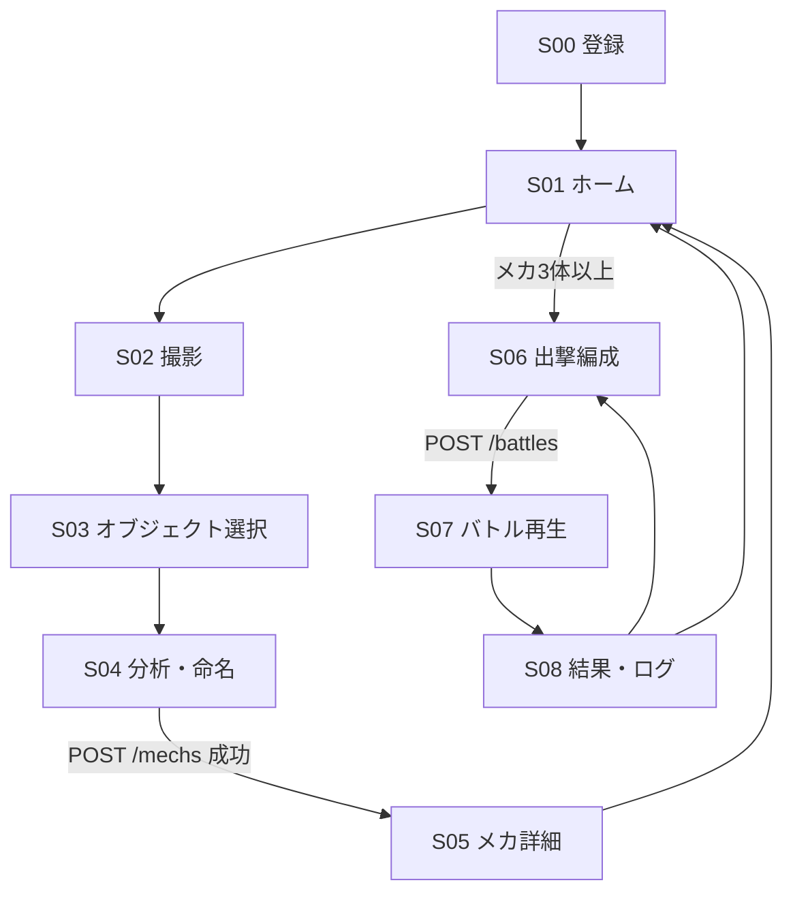

# 11. モバイルクライアント設計（Phase 1 縦切り）

[← 仕様書一覧](00_root_overview.md)

## 目的

iOS / Android ネイティブクライアントの Phase 1 縦切り（登録 → 撮影 → オブジェクト選択 →
メカ生成 → プリセット戦術 → CPU デモ戦 → ログ表示）の画面構成・遷移・共通アーキテクチャを
定義する。機能仕様の正本は [`docs/01`](01_game_concept_and_loop.md)〜[`09`](09_lightweight_server_architecture.md)
であり、本書はそれをモバイル画面に落とし込む設計書である。

## 技術スタック（確定）

| 項目 | iOS | Android |
|---|---|---|
| 言語 / UI | Swift + SwiftUI | Kotlin + Jetpack Compose |
| カメラ | AVFoundation | CameraX |
| HTTP | URLSession (async/await) | OkHttp + kotlinx.serialization |
| トークン永続化 | Keychain | EncryptedSharedPreferences |
| 画像処理（features/1.0 移植） | CoreGraphics / vImage | android.graphics.Bitmap |
| テスト | XCTest | JUnit 5 |
| プロジェクト生成 | XcodeGen（`project.yml` を正本、CI で生成） | Gradle (Kotlin DSL) |

リポジトリ構成:

```text
clients/
  android/   # Gradle プロジェクト（アプリ + features/1.0 移植 + 単体テスト）
  ios/       # XcodeGen プロジェクト（同上。Linux 開発環境では macOS CI でビルド検証）
```

## 画面一覧と遷移（Phase 1）

| ID | 画面 | 主な要素 | 参照仕様 |
|---|---|---|---|
| S00 | パイロット登録 | 名前入力 → `POST /auth/register`、トークン保存 | docs/07 認証 |
| S01 | ホーム / ハンガー | メカ一覧（`GET /mechs`）、残クォータ表示（`GET /users/quotas`）、撮影ボタン、出撃ボタン | docs/01 |
| S02 | 撮影 | カメラプレビュー、被写体ガイド枠、明るさ・ブレ警告、シャッター | docs/02 撮影 UX |
| S03 | オブジェクト選択 | 撮影画像上のタップ / 矩形指定、簡易マスクプレビュー、やり直し | docs/02、docs/09（クライアント担当） |
| S04 | 分析・命名 | 特徴量プレビュー（情報量スコア）、メカ名入力、生成実行（`POST /mechs` 直登録） | docs/03、docs/09 主経路 |
| S05 | メカ詳細 | サーバー確定の型・ステータス・アート表示 | docs/03（型はサーバー確定値のみ表示） |
| S06 | 出撃編成 | 3 体選択（前衛・中衛・後衛）+ 各機のプリセット戦術選択（`GET /tactic-presets`） | docs/04、docs/05 |
| S07 | バトル再生 | `POST /battles` → `GET /battles/{id}` の `log_entries` をターン順に演出再生 | docs/05、docs/09（演出のみ） |
| S08 | 結果・ログ | 勝敗、全ログ（条件成立理由つき）、再戦 / ホームへ | docs/05 バトルログ |



- ナビゲーションは単一スタック（タブなし）。docs/07 の UX 原則（片手操作・短時間ループ）に従い、
  各画面の主ボタンは画面下部に置く。
- S06 はメカが 3 体未満のときは進入不可とし、ホームに「あと N 体」の案内を出す。

## エラー時遷移

| 発生点 | ステータス / 種別 | クライアント挙動 |
|---|---|---|
| 全画面 | 401 | トークン破棄 → S00 へ（再登録導線） |
| S04 生成 | 409 duplicate_capture | 「同じ写真は使えません」→ S02 へ再撮影導線 |
| S04 生成 | 422 unsafe_capture（face_detected / crop_too_small / empty_mask / solid_color_crop） | reason 別メッセージ → S02 再撮影 or S03 選択やり直し |
| S04 生成 | 422 feature_mismatch / unsupported_algo_version | 「アプリの更新が必要です」（クライアント実装ずれ。ユーザー操作では解消しない） |
| S04 生成 | 429 quota | 残クォータ 0 表示 → ホームへ（docs/06 の翌日回復を明記） |
| S02 撮影 | 明るさ・ブレ閾値超 | シャッター前に警告表示（docs/02。ブロックはしない） |
| 通信全般 | タイムアウト / オフライン | リトライボタン付きエラー表示。撮影〜特徴量プレビューまではオフライン動作可（docs/09） |

エラーは握り潰さず、必ず「再撮影」「別オブジェクト選択」「リトライ」いずれかの導線に接続する
（`AGENTS.md` エラーハンドリング）。

## 共通アーキテクチャ

各プラットフォームで MVVM を採用し、レイヤーを揃える。

```text
UI (SwiftUI / Compose)
  └─ ViewModel（画面状態、エラー種別 → 導線変換）
       ├─ ApiClient（HTTP、X-User-Token 付与、エラーマッピング）
       ├─ TokenStore（Keychain / EncryptedSharedPreferences）
       └─ CaptureEngine
            ├─ ObjectSelector（タップ / 矩形 → 簡易マスク）
            └─ FeatureExtractor（features/1.0 移植）
```

### API 経路（Phase 1 で使用するもの）

| 呼び出し | 用途 |
|---|---|
| `POST /auth/register` | 初回登録。以降 `X-User-Token` 必須 |
| `GET /users/quotas` | 残り生成枠の表示 |
| `POST /mechs`（multipart: `payload` JSON + `crop` RGBA PNG） | 主経路のメカ直登録（docs/09） |
| `GET /mechs` / `GET /mechs/{id}` | ハンガー一覧・詳細 |
| `GET /tactic-presets` | プリセット 5 種の取得 |
| `POST /battles` | CPU デモ戦（Phase 1。ランク戦は Phase 2） |
| `GET /battles/{id}` | `log_entries` 取得（演出再生の正本） |

バトルはサーバー権威であり、クライアントは `log_entries` の再生のみを行う。勝敗・ダメージを
クライアントで再計算してはならない（docs/09 信頼モデル、`AGENTS.md` 不変条件 1）。

### features/1.0 のネイティブ移植仕様

正本はサーバー実装 [`vision/analysis.py`](../src/photo_mecha_battle/vision/analysis.py) の
`canonicalize_rgba_crop` / `analyze_rgba_crop`。移植は以下の PIL 互換挙動を再現すること。

| 処理 | PIL 互換要件 |
|---|---|
| 正規化 | alpha < 128 の画素は RGB・alpha ともゼロ化。alpha ≥ 128 は 255 に二値化 |
| グレースケール | ITU-R 601-2: `L = (299R + 587G + 114B) / 1000`（整数演算） |
| エッジ検出 | 3×3 カーネル `(-1,…,8,…,-1)`、除数 1、オフセット 0。**画像外周 1px は入力値をそのまま保持**（PIL `FIND_EDGES` 準拠）、結果は 0–255 にクランプ |
| visual_entropy | L の 256 bin ヒストグラムのシャノンエントロピー / 8.0（上限 1.0） |
| edge_complexity | エッジ値 > 40 の画素比率 × 8.0（上限 1.0） |
| color_diversity | RGB を 64×64 に**バイキュービック**縮小 → ユニーク色数 / 256（上限 1.0） |
| capture_quality | `min(brightness, blur)`。brightness / blur の式は analysis.py 参照 |
| 形状系 | 二値マスクの bbox から area / elongation / roundness / symmetry / size_balance |

- リサンプリング（バイキュービック）の実装差は完全一致しない可能性があるため、サーバーは
  ε = 0.05 の許容差分を持つ（docs/09）。それを超える実装は 422 `feature_mismatch` になる。
- **一致検証の正本**: [`tests/golden/`](../tests/golden/golden_features.json)。クライアント単体テストは
  ゴールデン PNG を入力に、manifest の各特徴量と ε 以内で一致することを必須ゲートとする。
- `algo_version: "features/1.0"` を必ず送信する。

### オブジェクト選択（S03）の MVP 実装

docs/09 のとおり MVP は軽量処理でよい。サーバーの `segment_bbox` と同型のヒューリスティックを使う:

1. ユーザーが矩形（またはタップ点から自動拡張した矩形）を指定
2. 矩形内をクロップし、コーナー画素色との距離 > 55 を前景とする簡易マスク生成
3. マスクプレビューを表示し、ユーザーが確定 → 正規形 RGBA PNG を生成

将来のオンデバイス MLモデル（検出 / SAM 系）への差し替えは `ObjectSelector` の
インターフェース内に閉じる。

## テスト方針（クライアント）

| 層 | 内容 | ゲート |
|---|---|---|
| FeatureExtractor | ゴールデンフィクスチャ一致（ε=0.05） | 必須（CI） |
| ApiClient | エラーマッピング（401/409/422/429 → 導線種別） | 必須（CI） |
| ログ演出 | `log_entries` サンプル JSON のパースと表示モデル変換 | 必須（CI） |
| UI / カメラ | エミュレータ / 実機スモーク | merge 前手動（Pre-Merge Verification） |

CI で実 ML モデル推論は必須にしない（`AGENTS.md`）。

## Phase 1 でやらないこと

- 戦術スロット編集（`POST /tactics`）、チーム永続化（`/teams`）、ランク戦・ランキング UI — Phase 2
- RevenueCat SDK / Paywall — 外部ダッシュボード設定完了後
- オンデバイス ML 検出・セグメント、簡易スタイライズ（見た目はサーバー返却 `art_url` 表示のみ）
- 型のクライアント事前プレビュー（`form_inference/1.0` の移植）— サーバー確定値のみ表示

## 参照

| ドキュメント | 関係 |
|---|---|
| [`docs/02`](02_photo_object_extraction.md) | 撮影 UX・品質警告・安全性の機能要件 |
| [`docs/04`](04_tactics.md) | プリセット定義（S06） |
| [`docs/05`](05_team_and_battle.md) | バトルログ構造（S07/S08） |
| [`docs/09`](09_lightweight_server_architecture.md) | API 主経路・信頼モデル・責務分担 |
